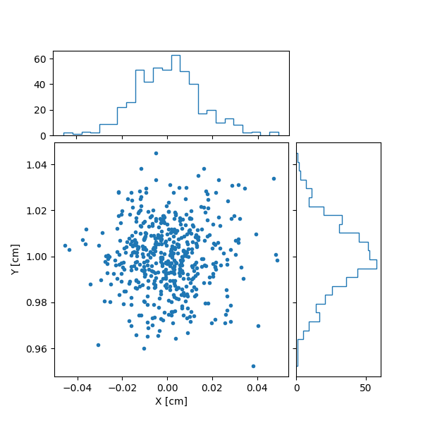
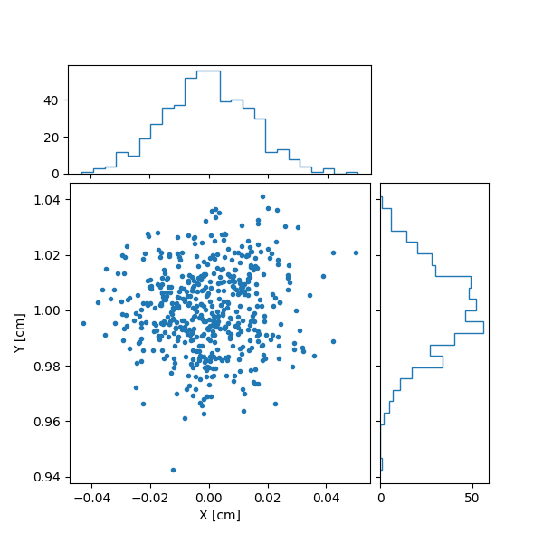
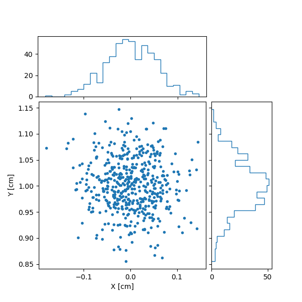
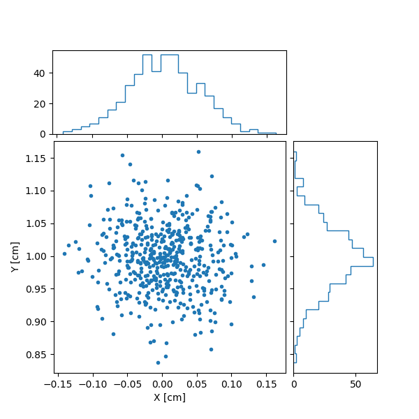

# Modified ComponentComsol for Garfield++

This code is about a modifield ComponentComsol for Garfield++ which allows loading external magnetic field from Comsol output. Within increasing demand of more prcise simulation, heterogeneity of magnetic field should be considered. However, the original Garfield++ Compoent only allows set a uniform magnetic field. This repository constians a modified `ComponetComsol` which allows loading external magnetic field from Comsol.

## How to use the code
1. Copy `ComponentComsol.hh` and `ComponentComsol.cc` to the folder of your simulation code
2. Replace `#include "Garfield/ComponentComsol.hh"` by `#include "./ComponentComsol.hh"`
3. Call `InitialiseMagnticField` after `Initialise`

A sample code of initialization is shown as below, 
```
    fm.Initialise("mesh.mphtxt", "dielectirc.dat", "potential.txt");
    fm.InitialiseMagnticField("mesh.mphtxt", "dielectirc.dat", "magneticfield.txt");
```
where `"magneticfield.txt"` is the comsol output of magnetic field. The rest are exact the same as original `ComponentComsol`.

This repository includes a sample of how to use the code.

## How this code works
This code is a modified version of ComponentComsol, with 3 extra function, `InitialiseMagnticField`, `MagneticField`, and `HasMagneticField`. Allows the user to load an external magnetic field, calculate magnetic field at certain point, and determine whether magnetic field is involved in the component.

The `InitialiseMagnticField` is a modified verion of function `Initialise`, replacing the input of potential by magnetic field.

The `MagneticField` uses the same method in function `ElectricField` in `ComponentFieldMap` to calculate each component of magnetic field.

## Prove of feasibility of the code
Since original Garfield++ can only take uniform magnetic field. Comparsion between `ComponetConstant` is taken. An 0 initial energy electron is drift from position (0,1,4.9)[cm] in a 5cm hight room temperature CF4 tube, to z = 0. `AvalancheMicroscopic` is used and 500 events is simulated. E field is set (0.,0.,99.994), which is same as what in Comsol. Two attemps taken within an uniform B = (0,0,0)[T] and (0,0,1)[T]. A python script `Analysis.py` is used to calulate sigma of the x-y coordinate of the end point of electrons.

### Electron Spread within 1T external magnetic field
Comsol result:  
XY coorinate sigma: 210.11013 [um]  
Average Drift time: 1532.17630 [ns], sigma: 15.54039 [ns]

****
ComponentConstant result:  
XY coorinate sigma: 212.63943 [um]  
Average Drift time: 1531.22486 [ns], sigma: 15.82442 [ns]

****
### Electron Spread within no external magnetic field
Comsol result:  
XY coorinate sigma: 734.32779 [um]  
Average Drift time: 1532.29710 [ns], sigma: 15.68462 [ns]

****
ComponentConstant result:  
XY coorinate sigma: 718.67973 [um]  
Average Drift time: 1531.46368 [ns], sigma: 16.40893 [ns]


Two results agrees